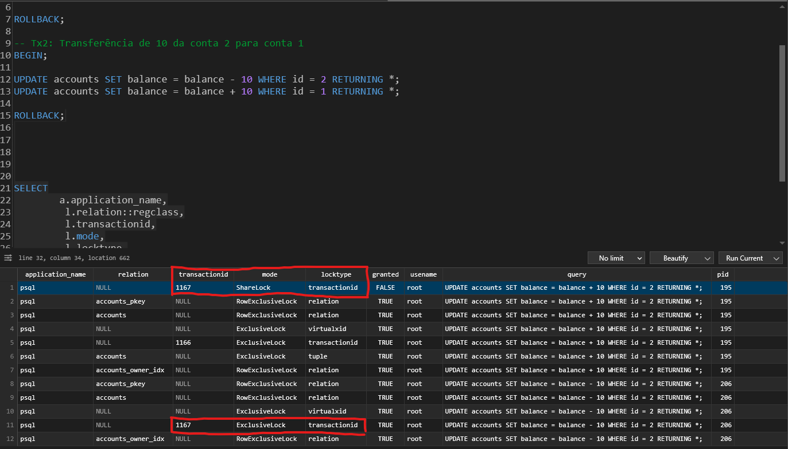
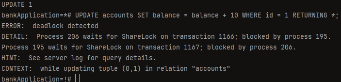
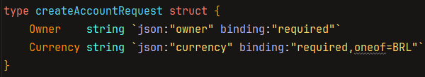
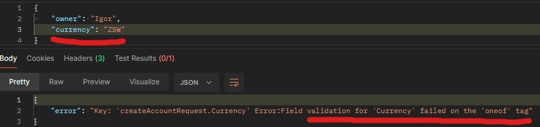
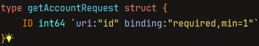
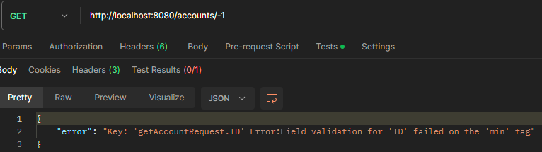
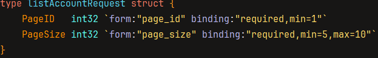

# Bank Application

## Database Design

---
## Deadlock
Script usado no TablePlus para identificar um dos Deadlock's
* `SELECT
  a.application_name,
  l.relation::regclass,
  l.transactionid,
  l.mode,
  l.locktype,
  l.GRANTED,
  a.username,
  a.query,
  a.pid
  FROM pg_stat_activity a
  JOIN pg_locks l ON l.pid = a.pid
  WHERE a.application_name = 'psql'
  ORDER BY a.pid;`

Foi possível identificar que a transação 1 estava tentando adquirir um ShareLock pelo transactionID '1167', porém, ela ainda não havia ganho um, pois a transação 2 já possuía um ExclusiveLock, no mesmo transactionID.

Portanto, **a transação 1 deve aguardar a transação 2 terminar antes de continuar**.

Ao tentar atualizar o saldo da conta 1, acontece o deadlock. A transação 2 também precisa aguardar a transação 1 terminar, para receber o resultado da consulta (query).
Resumo: O Deadlock ocorre, pois, ambas as transações concorrentes, **precisam aguardar a outra terminar.**
Para resolver, precisei mover a ordem do UPDATE da transação 2. Agora ambas as transações 1 e 2 **sempre irão atualizar a account1 antes da account2**.
A melhor maneira de prevenir deadlocks é fazer com que a aplicação sempre **adquira locks em uma ordem consistente!**

---
## Validação
### Oneof
Com esse pequeno código `oneof`, o Gin valida o input, **obrigando que seja BRL.**

###### Ao passar uma string vazia ou um câmbio monetário inválido, ele retorna um erro.

### Min
O `min=1` valida que o ID deve ser no mínimo um **inteiro positivo 1**

###### Exemplo de erro no Postman:

---

## Paginação
* No arquivo api/accounts.go, eu limitei a quantidade de contas que podem ser retornadas da seguinte maneira:

* Caso o id enviado seja 0, o **validador** do Gin irá retornar um `failed on the 'required' tag` 

---

## Viper - Carregando configurações a partir de um arquivo e variáveis de ambiente
* Por que um arquivo?
  * Facilita a especificação da configuração padrão para desenvolvimento local e de teste.
* Por que variáveis de ambiente? (Env)
  * Facilitam a sobrescrita das configurações padrões quando é feito o deploy da aplicação.
* Viper pode encontrar, carregar e fazer unmarshal de arquivos de configuração
  * JSON, TOML, YAML, ENV, INI
* Também pode ler valores de variáveis de ambiente ou flags de linha de comando
  * Permite sobrescrever valores padrões
* Se preferir armazenar os arquivos de configuração em um sistema remoto como **etcd ou consul**, o viper pode ler a partir deles também
* Viper observa qualquer modificação nas configurações, podendo notificá-las também
  * Ele lê as mudanças feitas e as salva

---
## Mock - Por que mockar uma base de dados?
* Ajuda a escrever testes independentes facilmente, porque cada teste usará seu próprio banco de dados para armazenar dados, evitando conflitos entre eles.
  * Se tu usar um banco de dados real, todos os testes irão ler e escrever dados no mesmo lugar, aumentando a chance de conflitos, especialmente em grandes projetos.
* Os testes executarão rapidamente, visto que eles não precisarão se comunicar com o banco de dados real e esperar todas as queries serem executadas. Todas as ações são executadas em memória e dentro do mesmo processo.
* 100% de cobertura
  * Com um banco de dados mock, pode-se facilmente configurar e testar **alguns casos extremos**, como _unexpected error_ ou um _connection lost_, que seriam impossíveis de testar usando um banco de dados real.

### Como Mockar?
1. Implemente um banco de dados falso ou "fake", que armazena dados em memória.
   * Um porém: criar estruturas e funções pode demandar muito tempo, por isso utilizei GoMock nesse projeto.
2. GoMock gera e constrói stubs, que retornam dados hardcoded para cada cenário que queremos testar.
