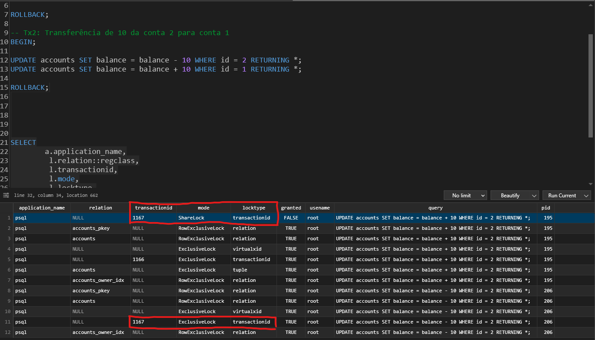
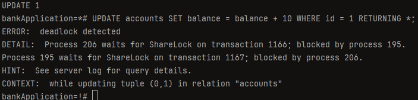
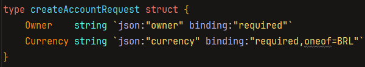
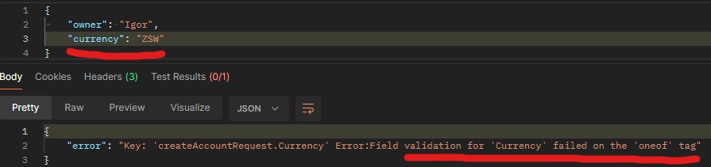
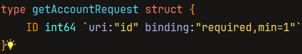
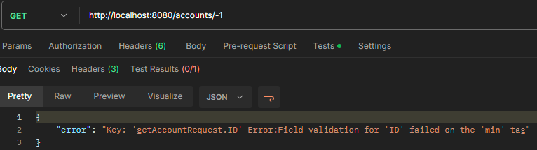

# Bank Application

---
## Deadlock
* Script usado no TablePlus para identificar um dos Deadlock's
* `SELECT
  a.application_name,
  l.relation::regclass,
  l.transactionid,
  l.mode,
  l.locktype,
  l.GRANTED,
  a.username,
  a.query,
  a.pid
  FROM pg_stat_activity a
  JOIN pg_locks l ON l.pid = a.pid
  WHERE a.application_name = 'psql'
  ORDER BY a.pid;`

* Foi possível identificar que a transação 1 estava tentando adquirir um ShareLock pelo transactionID '1167', porém, ela ainda não havia ganho um, pois a transação 2 já possuía um ExclusiveLock, no mesmo transactionID.

* Portanto, a transação 1 deve aguardar a transação 2 terminar antes de continuar.

* Ao tentar atualizar o saldo da conta 1, acontece o deadlock. A transação 2 também precisa aguardar a transação 1 terminar, para receber o resultado da consulta (query).
* Resumo: O Deadlock ocorre, pois, ambas as transações concorrentes, **precisam aguardar a outra terminar.**
* Para resolver, precisei mover a ordem do UPDATE da transação 2. Agora ambas as transações 1 e 2 **sempre irão atualizar a account1 antes da account2**.
* A melhor maneira de prevenir deadlocks é fazer com que a aplicação sempre **adquira locks em uma ordem consistente!**

---
## Validação
### Oneof
Com esse pequeno código `oneof`, o Gin valida o input, **obrigando que seja BRL.**

Ao passar uma string vazia ou um câmbio monetário inválido, ele retorna um **erro**.

### Min
O `min=1` valida que o ID deve ser no mínimo um **inteiro positivo 1**

Exemplo de erro no Postman:

---
## Paginação